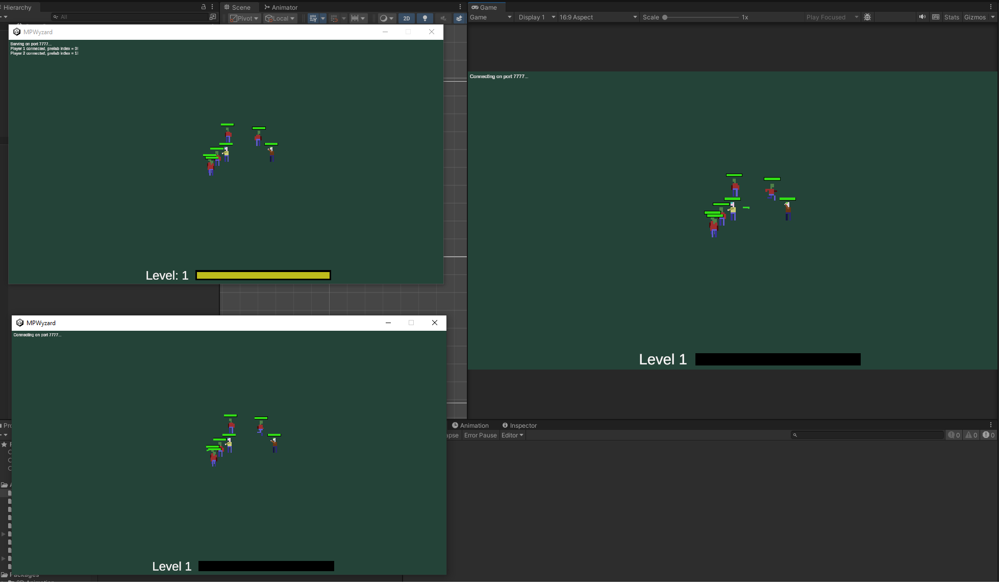

# MPWyzards

This project is a demonstration of a client/server multiplayer project build with Netcode for GameObjects in Unity.

The game is a ripoff of Vampire Survivors.
Players have to stay alive, avoiding enemies while the avatar's automatically shoot in the direction of the closest one. When enough XP pellets are consumed by a player, he can choose what to upgrade (extra damage or faster fire rate).
Game is over when both players are dead.

# License

* All source code by Diogo Andrade is licensed under the [MIT] license.

#
# Metadata

* Autor: [Diogo Andrade]
- Curso:  [Licenciatura em Videojogos][LAMV]
- Instituição: [Universidade Lusófona - Centro Universitário de Lisboa][UL-CUL]

[Diogo Andrade]:https://github.com/DiogoDeAndrade
[LAMV]:https://www.ulusofona.pt/licenciatura/videojogos
[UL-CUL]:https://www.ulusofona.pt/